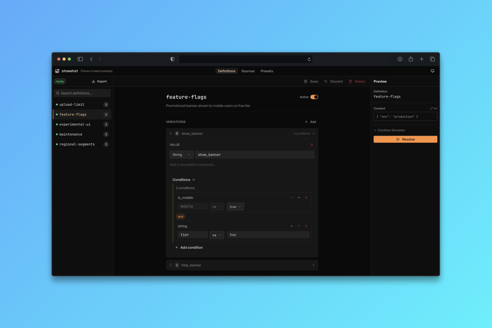

<div align="center">

<picture>
  <source srcset="public/logo-v2-w.svg" media="(prefers-color-scheme: dark)">
  
</picture>

# showwhat

Schema and rule engine for **feature flags** and **config** resolution
<br />Inspired by OpenAPI and Swagger

[](https://www.npmjs.com/package/showwhat)
[](https://opensource.org/licenses/MIT)

**[Documentation](https://showwhat.yeojz.dev)** | **[Quick Start](https://showwhat.yeojz.dev/docs/)** | **[Concepts](https://showwhat.yeojz.dev/docs/definitions)**

<picture>

</picture>

</div>

## Features

- Define flags and config as [definitions](https://showwhat.yeojz.dev/docs/definitions) and declare which [variation](https://showwhat.yeojz.dev/docs/variations) is served based on [conditions](https://showwhat.yeojz.dev/docs/conditions).
- TypeScript-first with Zod validation.
- Supports `booleans`, `strings`, `numbers`, `arrays` and `objects` as resolved variation values.
- Supports both `yaml` or `json`.
- Runtime evaluation against user defined [context](https://showwhat.yeojz.dev/docs/context).
- Supports [annotations](https://showwhat.yeojz.dev/docs/annotations) for condition chaining and cross-dependency.
- Ability to define [presets](https://showwhat.yeojz.dev/docs/presets.html) for condition reuse.
- Extensible with [custom conditions](https://showwhat.yeojz.dev/docs/custom-conditions).
- Store definitions in files and manage them in version control or serve them from an API.

A browser based schema [configurator](https://showwhat.yeojz.dev/configurator/) is also provided / available.

## Packages

| Package                                             | Description                                              |
| --------------------------------------------------- | -------------------------------------------------------- |
| [`showwhat`](./packages/showwhat)                   | Main API for resolving feature flags and config values   |
| [`@showwhat/core`](./packages/core)                 | Rule engine, schemas, parsers, and in-memory data source |
| [`@showwhat/configurator`](./packages/configurator) | React UI library for visual rule editing                 |
| [`@showwhat/openfeature`](./packages/openfeature)   | OpenFeature bridge for showwhat definitions              |
| [webapp](./apps/webapp)                             | Browser app for authoring and testing definitions        |
| [docs](./apps/docs)                                 | Documentation site                                       |

## Quick start

### Install

```bash
npm install showwhat
pnpm add showwhat
yarn add showwhat

# Other runtimes
bun add showwhat
deno install npm:showwhat
```

### 1. Define your flags

Write a YAML (or JSON) file with a `definitions` root key. Each definition has one or more **variations** evaluated top-to-bottom — the first match wins.

```yaml
# flags.yaml
definitions:
  checkout_v2:
    variations:
      - value: true
        conditions:
          - type: env
            value: prod
      - value: false # default — no conditions means always matches
```

### 2. Load and resolve

```ts
import { showwhat, MemoryData } from "showwhat";

// Load definitions into an in-memory data source
const data = await MemoryData.fromYaml(fs.readFileSync("flags.yaml", "utf8"));

// Resolve flags against a runtime context
const results = await showwhat({
  keys: ["checkout_v2"],
  context: { env: "prod" },
  options: { data },
});
```

### 3. Use the result

Every result entry is either `{ success: true, value }` or `{ success: false, error }`:

```ts
const entry = results["checkout_v2"];
if (entry.success) {
  console.log(entry.value); // true
}
```

## Definition format

### Variations and conditions

Each definition lists variations in priority order. A variation matches when **all** its conditions pass. A variation with no conditions acts as a catch-all default.

```yaml
definitions:
  signup_flow:
    variations:
      - value: "v2"
        conditions:
          - type: string
            key: tier
            op: in
            value: [enterprise, pro]
      - value: "v1" # default

  max_upload_size:
    variations:
      - value: 100
        conditions:
          - type: number
            key: tier_level
            op: gte
            value: 2
      - value: 25
```

Values can be `booleans`, `strings`, `numbers`, `arrays`, or full `objects`.

### Built-in condition types

| Type       | Description                          | Example                                                              |
| ---------- | ------------------------------------ | -------------------------------------------------------------------- |
| `env`      | Shorthand for matching `context.env` | `{ type: env, value: prod }`                                         |
| `string`   | Compare any string key               | `{ type: string, key: tier, op: eq, value: pro }`                    |
| `number`   | Compare any numeric key              | `{ type: number, key: level, op: gte, value: 2 }`                    |
| `bool`     | Compare any boolean key              | `{ type: bool, key: mobile, value: true }`                           |
| `datetime` | Compare any datetime key             | `{ type: datetime, key: at, op: gt, value: "2025-01-01T00:00:00Z" }` |
| `startAt`  | Passes when `context.at >= value`    | `{ type: startAt, value: "2025-06-01T00:00:00Z" }`                   |
| `endAt`    | Passes when `context.at < value`     | `{ type: endAt, value: "2025-07-01T00:00:00Z" }`                     |
| `and`      | All child conditions must pass       | `{ type: and, conditions: [...] }`                                   |
| `or`       | Any child condition must pass        | `{ type: or, conditions: [...] }`                                    |

See the [Conditions guide](https://showwhat.yeojz.dev/docs/conditions) for operators, regex matching, and more.

### Presets

Presets let you define reusable condition shorthands to keep definitions DRY:

```yaml
definitions:
  premium_feature:
    variations:
      - value: true
        conditions:
          - type: tier # uses the "tier" preset below
            op: in
            value: [pro, enterprise]
      - value: false

presets:
  tier:
    type: string
    key: tier # always reads context.tier
```

See the [Presets guide](https://showwhat.yeojz.dev/docs/presets.html) for composite presets and overrides.

## Security

showwhat assumes definition authors are trusted. See the [Security guide](https://showwhat.yeojz.dev/docs/security) for considerations when accepting definitions from untrusted sources.

## AI Usage Disclosure

The codebase, tests, and documentation was created with AI assistance, with outputs reviewed by humans. See [CONTRIBUTING.md](./CONTRIBUTING.md#ai-usage-guidelines) for guidelines.

## License

[MIT](./LICENSE)
